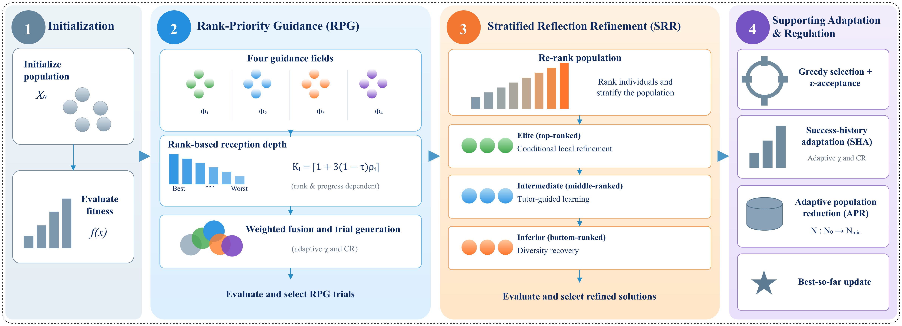
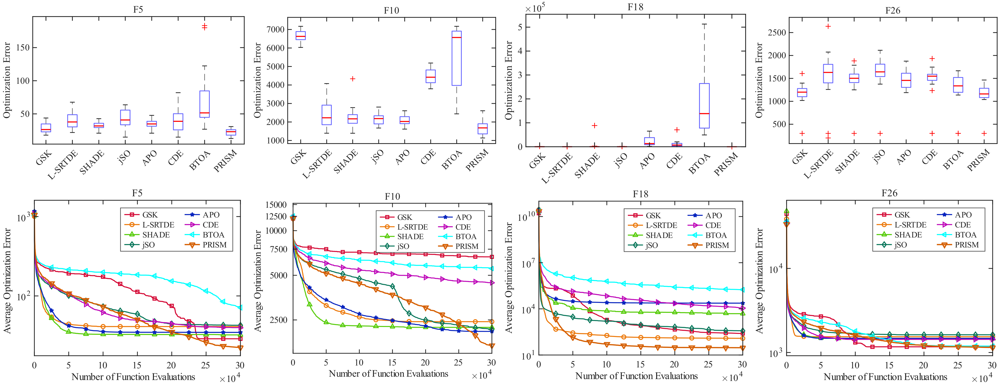
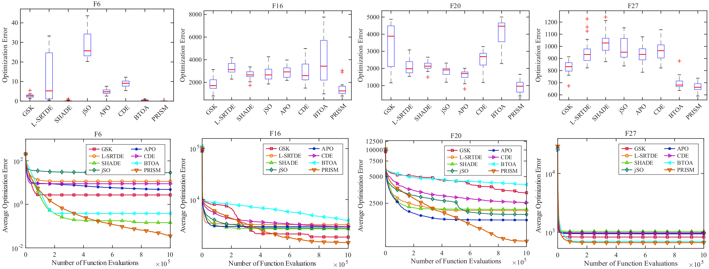
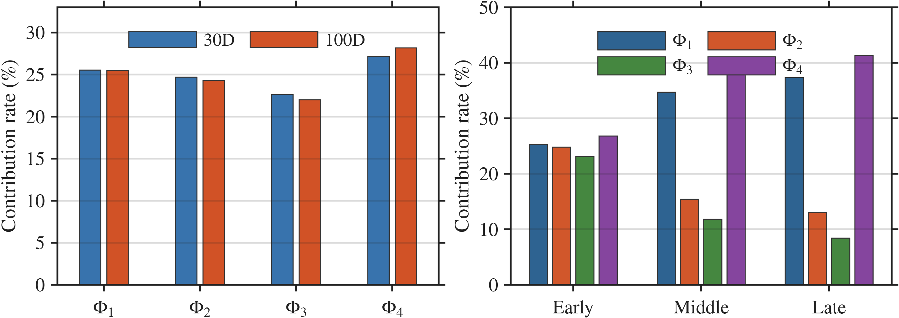
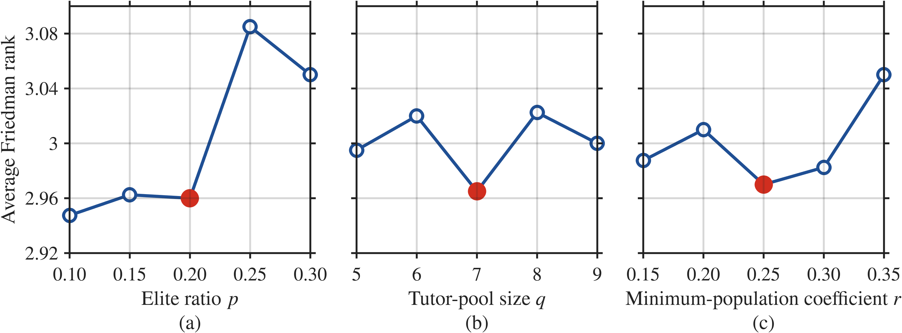
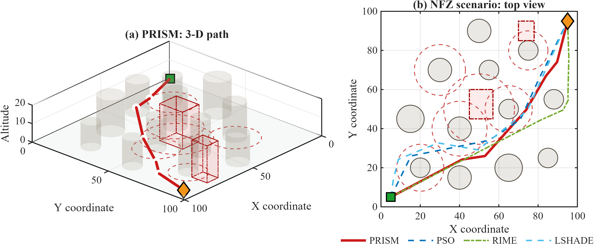
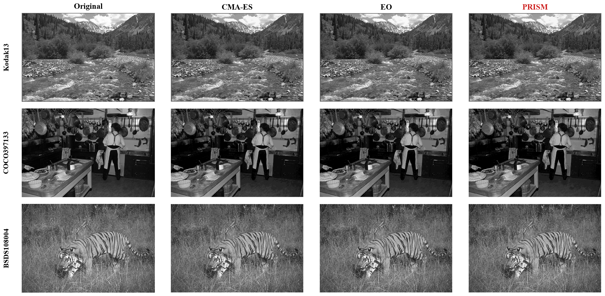
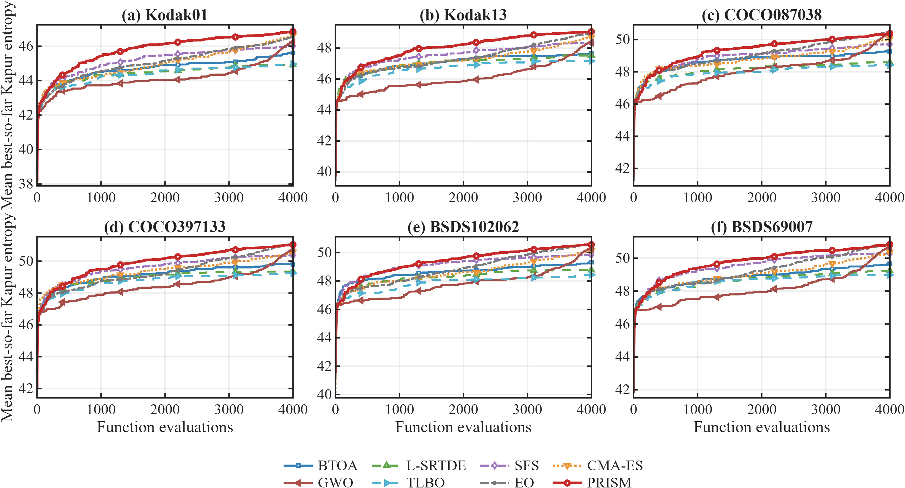

<div align="center">

<h1>PRISM</h1>

<p><b>Priority-Rank Integrated Search Mechanism</b></p>

<p><i>Population rank as one allocation signal, spanning two search stages</i></p>

<p>&nbsp;&nbsp;&nbsp;&nbsp;</p>

</div>


> **Manuscript status.** This repository is the reference-implementation and documentation companion to a manuscript that is **currently under review** at a peer-reviewed journal. The journal name is withheld while the review is in progress. The code, figures, and documentation here describe the submitted version of the work and may be updated once the review process concludes.


| | |
|:--|:--|
| **Manuscript** | PRISM: A Priority-Rank Integrated Search Mechanism for Single-Objective Black-Box Optimization |
| **Author** | **Qingke Zhang**\* |
| **Affiliation** | School of Computer Science and Artificial Intelligence, Shandong Normal University, Jinan 250358, China |
| **Corresponding author** | Prof. Qingke Zhang — [tsingke@sdnu.edu.cn](mailto:tsingke@sdnu.edu.cn) |
| **Status** | Under review — journal name withheld |


**Highlights**

- Proposes PRISM, a rank-driven search mechanism for single-objective black-box optimization.
- Introduces rank-priority guidance for rank- and progress-aware multi-source information reception.
- Designs stratified reflection refinement for layer-specific exploitation and diversity recovery.
- Achieves the lowest overall Friedman rank across 144 CEC2017/CEC2022 benchmark cases.
- Demonstrates effective transfer to constrained UAV path planning and multilevel image segmentation problems.


## Contents

1. [Background and motivation](#1-background-and-motivation)
2. [Method overview](#2-method-overview)
3. [Key contributions](#3-key-contributions)
4. [Framework and mechanisms](#4-framework-and-mechanisms)
5. [Benchmark evaluation](#5-benchmark-evaluation)
6. [Application case studies](#6-application-case-studies)
7. [Reference implementation](#7-reference-implementation)
8. [Funding and acknowledgments](#8-funding-and-acknowledgments)


## 1. Background and motivation

Population-based black-box optimization is the tool of choice when derivatives are unavailable or expensive to obtain. Differential evolution, particle swarm optimization, and the many population methods that followed have been applied to engineering design, image processing, scheduling, and autonomous planning. What these methods share is a single scarce resource: a fixed evaluation budget must be split between exploring the search space broadly and refining the regions that already look promising.

A large body of work addresses that split through ranking. The idea is appealing because rank is scale-free — it is invariant under any order-preserving transformation of the objective, so it carries the same meaning on a well-scaled problem and a badly scaled one. But in most rank-aware designs the ordering is spent on a *single* decision: which parents are selected, how strongly selection is biased, or how the population is partitioned into groups and roles. Rank is read once per cycle and then discarded.

That leaves a more specific question open. Individuals sitting in different search states plausibly need different amounts of directional information, and the population produced by an update plausibly needs different refinement behaviour than the population that went into it. If those two decisions are handled independently, the depth of information a solution receives and the role it plays afterwards stay only weakly coupled — even though both are naturally indexed by the same quantity.

PRISM takes the position that rank does not have to be spent once. It treats normalized rank as a common, scale-free allocation signal that is read **twice** within a single search cycle, and lets the second reading depend on the population the first one produced.


## 2. Method overview

Each PRISM iteration runs two stages in sequence and gives each of them a distinct job.

**Rank-priority guidance (RPG)** decides how much directional information every individual is entitled to receive. Reception depth is a function of normalized rank and of how much of the evaluation budget has been consumed, and the information itself is fused from a uniformly sampled subset of four population-relation fields. Better-ranked solutions receive less; poorer-ranked solutions receive more; the whole schedule tightens as the budget drains.

**Stratified reflection refinement (SRR)** then re-ranks the population that RPG has just produced and assigns a *different* refinement behaviour to each of the three resulting layers — elite, intermediate, and inferior. The refinement a solution receives is therefore chosen by where it stands after the update, not by where it stood before it.

Success-history adaptation, ε-acceptance, and adaptive population reduction run alongside as supporting regulation. They tune parameters, admit the occasional non-improving trial, and shrink the population as the budget is spent, but they do not define the rank-conditioned allocation principle itself. Because the second stage consumes the ordering produced by the first, refinement becomes the natural continuation of guidance rather than a competing user of the same evaluations.


## 3. Key contributions

**Rank conditions two successive decisions rather than one.** Existing rank-aware designs spend the ordering on selection pressure or on population topology. PRISM reads the ordering twice in the same cycle: RPG converts it into information-reception depth before the update, and SRR converts the *new* ordering into refinement behaviour after it. The two decisions are coupled through the population itself, which is what the previous stage actually changed.

**RPG allocates reception depth from rank and progress together.** Each individual fuses a uniformly sampled subset of four population-relation fields — global quality contrast, exploratory variation, high-quality displacement, and poor-to-elite correction — weighted by magnitude. How many of those fields an individual may draw on is set by `K_i = ⌈1 + 3(1 − τ)ρ_i⌉`, so the current best receives one field and the rest receive two to four, with poorer-ranked individuals assigned at least as much depth. Depth decreases stepwise as the run proceeds, and the whole rule is scale-free because it is built on `ρ` and `τ` alone.

**SRR turns the updated ordering into three different jobs.** After re-ranking, the top layer is refined locally, the middle layer learns from a tutor pool, and the bottom layer is used for diversity recovery — its role is to keep the search from collapsing rather than to polish anything. The design assumes that the appropriate behaviour is set by post-update standing, which the ablation study supports: removing SRR produces by far the largest deterioration of any component examined.

**The evaluation covers more than one axis of comparison.** PRISM is benchmarked against 25 algorithms over 144 CEC2017/CEC2022 function–dimension cases, then examined through controlled variants, weighted field-attribution analysis, and one-factor parameter sensitivity. Two applications — constrained 3-D UAV path planning and 20-threshold Kapur image segmentation — test whether the same mechanism survives representations and feasibility conditions that numerical benchmarks never exercise.


## 4. Framework and mechanisms

The overall control flow is shown below. RPG runs first and produces a trial population; SRR re-ranks that population and refines it layer by layer; supporting regulation then closes the cycle before the budget check sends control back to the top.

<p align="center">
  
</p>

<p align="center">
  <em><b>Figure 1.</b> Framework of PRISM. RPG and SRR form the two-stage rank-guided search, while success-history adaptation, ε-acceptance, adaptive population reduction, and best-so-far updating provide supporting regulation.</em>
</p>

The two stages are described separately below.

**Rank-priority guidance.** Writing `ρ_i = (r_i − 1)/(N − 1)` for normalized rank and `τ = FEs/MaxFEs` for search progress, RPG builds four relation fields from the current best `x_best`, a randomly drawn elite reference, a randomly drawn poor reference, and two distinct random solutions:

| Field | Definition | Role |
|:--|:--|:--|
| Φ₁ | `x_best − x_poor` | global quality contrast |
| Φ₂ | `x_r1 − x_r2` | exploratory variation |
| Φ₃ | `x_best − x_elite` | high-quality displacement |
| Φ₄ | `x_elite − x_poor` | poor-to-elite correction |

The four are not linearly independent — Φ₁ = Φ₃ + Φ₄ — but they remain operationally distinct because RPG samples a subset `S_i` of size `K_i` uniformly without replacement and reweights only the fields it drew, using magnitude-normalized fusion weights. The resulting step is applied through a binomial crossover mask with one coordinate forced active, and the trial is clipped to the box before evaluation. Because `K_i` depends on `ρ` and `τ` only, the whole allocation rule is invariant to any order-preserving rescaling of the objective.

**Stratified reflection refinement.** SRR re-ranks the post-RPG population and splits it into an elite layer (top `pN`), an intermediate layer (up to `⌊N/2⌋`), and an inferior layer (the remainder). The elite is refined by a local move toward the best-so-far solution whenever the elite has already contracted inside a radius threshold; otherwise the elite learns from a tutor pool drawn from the leading solutions. The intermediate layer also learns from that tutor pool, with a coordinate-activation probability that grows with rank, while the inferior layer is pulled toward the tutor-pool centre with an added stochastic term — a diversity-recovery move rather than a refinement. A small rank-dependent reset probability reinitialises individual coordinates outright, which prevents the lower layer from becoming uniformly poor.

**Supporting adaptation and regulation.** Success-history adaptation maintains `H = 5` memory entries for the scale factor and crossover rate and updates them by weighted Lehmer means once enough strict improvements have accumulated. Both stages use greedy selection, except that an unprotected individual may accept a non-improving trial with probability `ε_acc = 0.001`; the individual identified as best at the start of a sweep is exempt. Population size decreases linearly from `N₀` toward `N_min = min{N₀, max(4, round(rD))}` as the budget is consumed, with the worst-ranked individuals removed first.

**Complexity.** Each cycle performs at most three rankings and two population sweeps. Ranking costs `O(N log N)` and field construction, fusion, and coordinate updates cost `O(ND)`, so the arithmetic cost excluding objective evaluations is `O(N log N + ND)`. Storage is `O(ND)` for the population plus `O(H)` for the success-history memory, and the number of objective evaluations is bounded by `MaxFEs`. In typical black-box settings objective evaluations dominate runtime, and the population reduction steadily lowers the per-cycle overhead as the run proceeds.


## 5. Benchmark evaluation

PRISM was evaluated on CEC2017 (30 functions at 10D/30D/50D/100D) and CEC2022 (12 functions at 10D/20D), giving 144 function–dimension cases. All 26 algorithms received the same bounds, objective interface, dimensionality, initialization accounting, and `10000D` function-evaluation budget, with `N₀ = 40` fixed across methods so that search-rule differences are isolated under a common starting population. Every method was run independently 20 times, and the comparison is backed by two-sided Wilcoxon rank-sum tests together with a Friedman ranking over the complete case set.

### Overall ranking

| Setting | PRISM Friedman rank | PRISM position |
|:--|:--:|:--:|
| CEC2017 @ 10D | 3.80 | 1st |
| CEC2017 @ 30D | 2.67 | 1st |
| CEC2017 @ 50D | 2.27 | 1st |
| CEC2017 @ 100D | 3.43 | 1st |
| CEC2022 @ 10D | 4.13 | 1st |
| CEC2022 @ 20D | 3.88 | 1st |
| **All 144 cases** | **3.20** | **1st of 26** |

PRISM takes the lowest overall Friedman rank (3.20) among the 26 compared algorithms and ranks first in every one of the six settings. The omnibus test confirms that the 26 algorithms are not equivalent (χ²_F = 2206.05, df = 25; Iman–Davenport F_F = 226.31, p < 0.001). The nearest competitors over the full case set are GSK (5.52), L-SRTDE (5.88), APO (6.74), SHADE (7.43), and jSO (7.52).

<p align="center">
  
  <br>
  <em><b>Figure 2.</b> Final-error distributions (top) and mean best-so-far convergence (bottom) of PRISM against seven principal competitors on CEC2017 F5, F10, F18, and F26 at 30D over 20 independent runs.</em>
</p>

<p align="center">
  
  <br>
  <em><b>Figure 3.</b> The same comparison at 100D. The separation is not confined to the low-dimensional end of the suite.</em>
</p>

### Mechanism and robustness analysis

Five controlled variants were run under identical settings. Removing SRR produces by far the largest deterioration; disabling population reduction costs a moderate amount; and the two RPG depth controls — fixing `K_i = 2` and shuffling the rank-to-individual correspondence — show mainly aggregate-level effects.

| Variant | Avg. Friedman rank | W/T/L (of 120) |
|:--|:--:|:--:|
| **PRISM (complete)** | **3.04** | — |
| w/o SRR | 4.83 | 79 / 34 / 7 |
| w/o APR | 3.52 | 29 / 83 / 8 |
| w/o SHA | 3.25 | 16 / 88 / 16 |
| fixed `K_i = 2` | 3.16 | 8 / 111 / 1 |
| shuffled `ρ` | 3.21 | 5 / 113 / 2 |

The result sharpens the roles of the design elements. SRR is the load-bearing component: without post-update stratified refinement, repeated RPG search alone is substantially weaker. Population reduction acts as a genuine resource-allocation regulator. Success-history adaptation plays a supporting role only — its removal has a smaller, dimension-dependent effect, and the variant without it even ranks better at 100D. The two RPG depth variants produce modest aggregate gains with mostly statistically undetectable per-function differences, which is consistent with the depth rule shaping allocation rather than driving individual function outcomes.

<p align="center">
  
  <br>
  <em><b>Figure 4.</b> Weighted participation of the four RPG fields in strict improvements on CEC2017: overall rates at 30D and 100D (left), and early-, middle-, and late-stage rates (right). Multi-field gains are attributed by fusion weight; the rates are descriptive rather than causal estimates of isolated field effects.</em>
</p>

<p align="center">
  
  <br>
  <em><b>Figure 5.</b> One-factor-at-a-time sensitivity of the three principal parameters, each value reported as an average Friedman rank over CEC2017 at 10D, 30D, 50D, and 100D. Red markers denote the defaults `p = 0.20`, `q = 7`, `r = 0.25`.</em>
</p>

The sensitivity study locates the defaults inside a comparatively flat operating region. The tutor-pool size `q` is the least sensitive of the three across `q = 5`–`9`, and the minimum-population coefficient `r` stays stable over `0.15`–`0.30`; the elite ratio `p` is the parameter with the sharpest response, which is expected given that it sets how much of the population is treated as elite by SRR.


## 6. Application case studies

Benchmark suites measure solution quality under a fixed protocol, not whether an optimizer survives contact with a problem whose representation and constraints are set by someone else. PRISM was therefore embedded unchanged into two applications with very different decision structures.

**Constrained 3-D UAV path planning.** Five free waypoints (`M = 5`, `D = 15`) connect a start point to a goal point inside a workspace containing cylindrical obstacles, soft threat regions, and no-fly zones. The evaluated trajectory is the six-segment polyline through start, waypoints, and goal — no B-spline smoothing is applied during either evaluation or visualization, so the optimizer is scored on the path it actually produces. The penalized objective combines normalized length, a soft proximity/threat term, a maneuverability term on turn angles, and hard-constraint penalties. Here PRISM is evaluated directly on constrained continuous vectors, and feasibility is checked continuously along each segment.

**Kapur-entropy multilevel thresholding for image segmentation.** Each candidate is an ascending vector of gray-level thresholds, repaired to feasibility by a common deterministic mapping and scored by Kapur entropy over the image histogram. Difficulty grows with the threshold count, and the objective becomes progressively more rugged as more thresholds are admitted. Here the optimizer searches a continuous space whose candidates are mapped onto a discrete decision structure.

### UAV path planning results

Over 20 independent runs under a common 6000-FE budget, PRISM obtains the lowest mean final cost on the three harder scenarios (S2–S4) and the best overall scenario rank (**1.25**). The advantage scales with geometric difficulty: relative to the best competing mean, PRISM reduces the mean cost on S2, S3, and S4 by approximately **1.0%**, **2.9%**, and **2.4%**. On the simplest scenario (S1) GSK is marginally lower — 0.3596 versus 0.3599 — so the gain is not a uniform dominance but an aggregate one that grows with scenario complexity.

The constraint statistics reinforce the same reading. PRISM achieves **100% geometric feasibility over all 80 runs** and a **98.8% combined compliance rate (79 of 80 runs simultaneously satisfying the geometric and maneuverability requirements)**. The closest competitor on combined compliance reaches 97.5%, while the remaining competitors range from 8.8% to 93.8%.

<p align="center">
  
  <br>
  <em><b>Figure 6.</b> Representative combined-compliant paths in the no-fly-zone scenario. Gray cylinders and circles denote obstacles, dashed red circles denote soft threat regions, red rectangles denote no-fly zones, and the green square and orange diamond mark the start and goal.</em>
</p>

<p align="center">
  
  <br>
  <em><b>Figure 7.</b> Mean best-so-far UAV convergence over 20 independent runs for PRISM and the four best-ranked competitors under the common 6000-FE budget. Main panels use logarithmic vertical scales; insets magnify the late-stage interval from 3000 to 6000 FEs on linear scales. Lower is better.</em>
</p>

### Multilevel thresholding results

At 20 thresholds over 12 images and 20 runs each (4000 FEs), PRISM achieves the best aggregate Kapur rank (**1.67**) and the highest overall mean Kapur entropy (**49.7604**), against 1.83 and 49.7418 for the closest competitor. PRISM and that competitor each obtain the highest image-wise mean on six of the twelve images. The small numerical gap and the tied best-count indicate that the advantage is aggregate rather than uniform: PRISM has the better overall rank across the complete image set, but it does not dominate on every individual image.

<p align="center">
  
  <br>
  <em><b>Figure 8.</b> Illustrative 20-threshold reconstructions on three test images. Columns show the original image and the best-Kapur CMA-ES, EO, and PRISM reconstructions.</em>
</p>

<p align="center">
  
  <br>
  <em><b>Figure 9.</b> Mean best-so-far Kapur convergence on six representative images over 20 runs and 4000 FEs. Higher values are better.</em>
</p>

The takeaway is deliberately scoped. The two studies establish that the same RPG–SRR mechanism can be *embedded* into a constrained continuous planner and into a discrete-mapped segmentation problem without task-specific redesign, and can produce stable, competitive results in both. They are not evidence that a general-purpose optimizer out-performs every domain-specific solver, and the application-specific feasibility and repair layers remain external to the optimizer itself.


## 7. Reference implementation

The reference implementation is a single self-contained MATLAB function. It has no external dependencies beyond the objective function handle supplied by the caller, and it reproduces the benchmark configuration reported in the manuscript.

```matlab
% Caller supplies the objective handle and the problem definition.
% MaxFEs is set inside the file to popsize * maxiter, so N0 = 40 with
% maxiter = 7500 reproduces the 10000*D function-evaluation budget at D = 30.
[gbestX, gbestfitness, gbesthistory] = PRISM( ...
    [], 40, 30, 100, -100, [], [], 7500, @myObjective, 1, false);
```

<details>
<summary><b>Click to expand the full <code>PRISM.m</code> source (with inline documentation)</b></summary>


```matlab
function [gbestX,gbestfitness,gbesthistory] = PRISM(mainHandle,popsize,dimension,xmax,xmin,vmax,vmin,maxiter,Func,FuncId,VisualSwitch)
% =========================================================================
%  PRISM -- Priority-Rank Integrated Search Mechanism
%
%  Reference implementation of the algorithm described in the manuscript:
%    "PRISM: A Priority-Rank Integrated Search Mechanism for Single-Objective
%     Black-Box Optimization"
%
%  The manuscript is currently UNDER REVIEW at a peer-reviewed journal.
%  The journal name is withheld for the duration of the review process.
%  This citation record will be updated once the review concludes.
%
%  Copyright (c) 2026  Qingke Zhang
%  School of Computer Science and Artificial Intelligence
%  Shandong Normal University, Jinan 250358, China
%
%  Released under the MIT License. See the LICENSE file in the repository
%  root for the full text. If you use this code in academic work, please
%  cite the manuscript above (see also CITATION.cff).
%
%  Version : V1.0
%  Updated : 2026-09-16
%
% -------------------------------------------------------------------------
%  Input arguments
%    mainHandle    - reserved handle for an external driver (currently unused)
%    popsize       - initial population size N0
%    dimension     - problem dimensionality D
%    xmax, xmin    - upper / lower bounds on the decision variables; scalar or
%                    1-by-D vectors
%    vmax, vmin    - reserved velocity bounds (currently unused: PRISM is a
%                    position-only search and carries no velocity term)
%    maxiter       - iteration cap; MaxFEs is derived as popsize * maxiter
%    Func          - function handle of the objective, called as f(x, FuncId)
%    FuncId        - numeric identifier forwarded to Func
%    VisualSwitch  - display flag; when true, progress is printed every 10%
%                    of the evaluation budget
%
%  Output arguments
%    gbestX        - best solution found, 1-by-D
%    gbestfitness  - objective value of gbestX
%    gbesthistory  - 1-by-MaxFEs record of the best-so-far objective value
%
% -------------------------------------------------------------------------
%  Design notes
%    MaxFEs is computed as popsize * maxiter rather than hard-coded, so the
%    benchmark configuration (N0 = 40, a 10000*D function-evaluation budget)
%    is reproduced by passing maxiter = 250*D. The search itself uses no
%    velocity term: every trial is produced by clipping a position update
%    to [lb, ub].
%
%    Default parameters: p = 0.20, q = 7, r = 0.25, H = 5, epsAccept = 0.001.
%
%    Note: this file releases a snapshot of the implementation that
%    accompanies the submitted manuscript. Any code or results released
%    after the review process concludes should be treated as authoritative.
% =========================================================================
FEs = 0;
MaxFEs = popsize * maxiter;
Fitness = Func;

q = 7;
p = 0.20;
r = 0.25;
epsAccept = 0.001;
epsVal = realmin;
[lb,ub,range] = makeBounds(xmin,xmax,dimension,epsVal);
H = 5;
Mchi = 0.5 * ones(H,1);
MCR  = 0.9 * ones(H,1);
kh = 1;

chiList = [];
crList = [];
dfList = [];

N0 = popsize;
Nmin = min(N0,max(4,round(r * dimension)));
x = lb + rand(popsize,dimension).*range;
fitness = inf(popsize,1);

gbestfitness = inf;
gbestX = zeros(1,dimension);
gbesthistory = zeros(1,MaxFEs);

for i = 1:popsize
    if FEs >= MaxFEs, break; end

    fitness(i) = Fitness(x(i,:)',FuncId);
    FEs = FEs + 1;
    if fitness(i) < gbestfitness
        gbestfitness = fitness(i);
        gbestX = x(i,:);
    end
    gbesthistory(FEs) = gbestfitness;
end
while FEs < MaxFEs

    [~,ind] = sort(fitness,'ascend');
    bestID = ind(1);
    Best = x(bestID,:);
    rank = zeros(popsize,1);
    rank(ind) = 1:popsize;

    % ================= Stage 1: rank-priority learning =================
    for i = 1:popsize
        if FEs >= MaxFEs, break; end

        t = min(1,max(0,FEs/MaxFEs));

        chi = min(1.0,max(0.05,Mchi(randi(H)) + 0.05*randn));
        CR  = min(1.0,max(0.30,MCR(randi(H))  + 0.05*randn));
        elitePool = ind(2:min(q,popsize));
        if isempty(elitePool)
            elitePool = ind(1);
        end
        poorPool = ind(max(1,popsize-q+1):popsize);
        Elite = x(elitePool(randi(numel(elitePool))),:);
        Worst = x(poorPool(randi(numel(poorPool))),:);
        ids = selectID(popsize,i,2);

        Phi = zeros(4,dimension);
        nPhi = 4;

        Phi(1,:) = Best - Worst;
        Phi(2,:) = x(ids(1),:) - x(ids(2),:);
        Phi(3,:) = Best - Elite;
        Phi(4,:) = Elite - Worst;

        if popsize > 1
            rho = min(1,max(0,(rank(i)-1)/(popsize-1)));
        else
            rho = 0;
        end

        K = max(1,min(nPhi,ceil(1 + 3*(1-t)*rho)));
        Omega = randperm(nPhi,K);

        s = zeros(1,K);
        for k = 1:K
            s(k) = norm(Phi(Omega(k),:)) + epsVal;
        end
        step = zeros(1,dimension);
        total = sum(s) + epsVal;

        for k = 1:K
            step = step + (s(k)/total) * chi * Phi(Omega(k),:);
        end

        oldx = x(i,:);
        oldfit = fitness(i);

        newx = oldx;
        jrand = randi(dimension);
        mask = rand(1,dimension) < CR;
        mask(jrand) = true;

        newx(mask) = oldx(mask) + step(mask);
        newx = clip(newx,lb,ub);
        newfit = Fitness(newx',FuncId);
        FEs = FEs + 1;
        if newfit < oldfit
            df = oldfit - newfit;
            x(i,:) = newx;
            fitness(i) = newfit;

            chiList = [chiList; chi]; 
            crList  = [crList;  CR];  
            dfList  = [dfList;  df];  

        elseif rand < epsAccept && i ~= bestID
            x(i,:) = newx;
            fitness(i) = newfit;
        end

        if numel(chiList) >= H
            w = dfList / (sum(dfList) + epsVal);

            Mchi(kh) = sum(w.*chiList.^2)/(sum(w.*chiList)+epsVal);
            MCR(kh)  = sum(w.*crList.^2)/(sum(w.*crList)+epsVal);

            Mchi(kh) = min(1.0,max(0.05,Mchi(kh)));
            MCR(kh)  = min(1.0,max(0.30,MCR(kh)));

            kh = mod(kh,H) + 1;
            chiList = [];
            crList = [];
            dfList = [];
        end
        if fitness(i) < gbestfitness
            gbestfitness = fitness(i);
            gbestX = x(i,:);
        end
        gbesthistory(FEs) = gbestfitness;
    end
    if FEs >= MaxFEs, break; end
    % ================= Stage 2: stratified reflection =================
    [~,ind] = sort(fitness,'ascend');
    bestID = ind(1);

    rank = zeros(popsize,1);
    rank(ind) = 1:popsize;

    topN = min(popsize,max(2,round(p * popsize)));
    half = floor(popsize/2);

    tutorPool = ind(1:min(q,popsize));
    eliteSet = ind(1:topN);

    radius = mean(sqrt(sum((x(eliteSet,:) - gbestX).^2,2))) / dimension;
    radius = max(1e-10,radius);

    center = mean(x(ind(1:min(q,popsize)),:),1);

    t = min(1,max(0,FEs/MaxFEs));
    localFlag = radius < 0.01;

    zeta = min(0.10,max(0.01,0.01 + 0.09*(1-t)));
    ns = 0.05 * (1-t);
    for i = 1:popsize
        if FEs >= MaxFEs, break; end

        ri = rank(i);
        oldx = x(i,:);
        oldfit = fitness(i);

        if ri <= topN && localFlag
            newx = oldx + radius*(gbestX-oldx) + 0.3*radius*range.*randn(1,dimension);
            newx = clip(newx,lb,ub);
            [x(i,:),fitness(i),FEs] = tryEval( ...
                oldx,newx,oldfit,Fitness,FuncId,FEs,i==bestID,epsAccept);
        else
            if ri <= topN
                phi = 0.10 + 0.10*(1-t);
                useTutor = true;
            elseif ri <= half
                phi = min(0.50,max(1/dimension,(ri-topN)/(half-topN+epsVal)*0.30));
                useTutor = true;
            else
                phi = min(0.50,max(min(3,dimension)/dimension,(ri-half)/(popsize-half+epsVal)*0.50));
                useTutor = false;
            end
            mask = rand(1,dimension) < phi;
            if any(mask)
                newx = oldx;

                if useTutor
                    tutor = x(tutorPool(randi(numel(tutorPool))),:);
                    newx(mask) = oldx(mask) + ...
                        (tutor(mask)-oldx(mask)).*rand(1,sum(mask));
                else
                    dir = center - oldx;
                    newx(mask) = oldx(mask) + ...
                        rand*dir(mask) + ns*range(mask).*randn(1,sum(mask));
                end
                reset = mask & (rand(1,dimension) < zeta);
                if any(reset)
                    newx(reset) = lb(reset) + range(reset).*rand(1,sum(reset));
                end
                newx = clip(newx,lb,ub);
                [x(i,:),fitness(i),FEs] = tryEval( ...
                    oldx,newx,oldfit,Fitness,FuncId,FEs,i==bestID,epsAccept);
            end
        end
        if fitness(i) < gbestfitness
            gbestfitness = fitness(i);
            gbestX = x(i,:);
        end
        if FEs <= MaxFEs
            gbesthistory(FEs) = gbestfitness;
        end
    end
    % ================= Adaptive population reduction =================
    newN = round(N0 - (N0-Nmin)*(FEs/MaxFEs));
    newN = max(Nmin,min(N0,newN));
    if popsize > newN
        [~,idx] = sort(fitness,'ascend');
        del = idx(end-(popsize-newN)+1:end);
        x(del,:) = [];
        fitness(del) = [];
        popsize = numel(fitness);
    end
    if nargin >= 11 && VisualSwitch
        if mod(FEs,max(1,floor(MaxFEs/10))) == 0
            fprintf('PRISM | FEs=%d/%d | Pop=%d | Best=%.16e\n',FEs,MaxFEs,popsize,gbestfitness);
        end
    end
end
if FEs < MaxFEs
    gbesthistory(FEs+1:MaxFEs) = gbestfitness;
elseif FEs > MaxFEs
    gbesthistory = gbesthistory(1:MaxFEs);
end
end
function [x,fit,FEs] = tryEval(oldx,newx,oldfit,Fitness,FuncId,FEs,protected,epsAccept)
newfit = Fitness(newx',FuncId);
FEs = FEs + 1;
if newfit < oldfit || (~protected && rand < epsAccept)
    x = newx;
    fit = newfit;
else
    x = oldx;
    fit = oldfit;
end
end
function x = clip(x,lb,ub)
x = min(max(x,lb),ub);
end
function r = selectID(N,i,count)
if N <= 1
    r = ones(1,count);
    return;
end
pool = 1:N;
pool(pool == i) = [];
if isempty(pool)
    r = ones(1,count);
elseif numel(pool) >= count
    r = pool(randperm(numel(pool),count));
else
    r = pool(randi(numel(pool),1,count));
end
end
function [lb,ub,range] = makeBounds(xmin,xmax,D,epsVal)
if isscalar(xmin)
    lb = repmat(xmin,1,D);
else
    lb = reshape(xmin,1,D);
end
if isscalar(xmax)
    ub = repmat(xmax,1,D);
else
    ub = reshape(xmax,1,D);
end
range = ub - lb;
range(range == 0) = epsVal;
end
```

</details>

The complete file is available at the repository root as [`PRISM.m`](PRISM.m). The default parameters are `p = 0.20`, `q = 7`, `r = 0.25`, `H = 5`, and `ε_acc = 0.001`; the population is initialised at `N₀ = 40` in the benchmark protocol.


## 8. Funding and acknowledgments

This work is supported by the National Natural Science Foundation of China (Grant No. 62006144). The author sincerely appreciates the Editor and all the reviewers for their valuable time, insightful comments, and efforts devoted to reviewing and improving this manuscript.


## Copyright

Copyright (c) 2026 Qingke Zhang. All rights reserved.

The source code `PRISM.m` is released under the [MIT License](LICENSE). The manuscript, the figures, and the documentation in this repository are the property of the author and may not be redistributed without permission. The accompanying manuscript is currently under review; please cite this work as a manuscript under review until the citation record is updated. See [NOTICE.md](NOTICE.md) for details.


<div align="center">
<sub>School of Computer Science and Artificial Intelligence, Shandong Normal University</sub>
</div>
